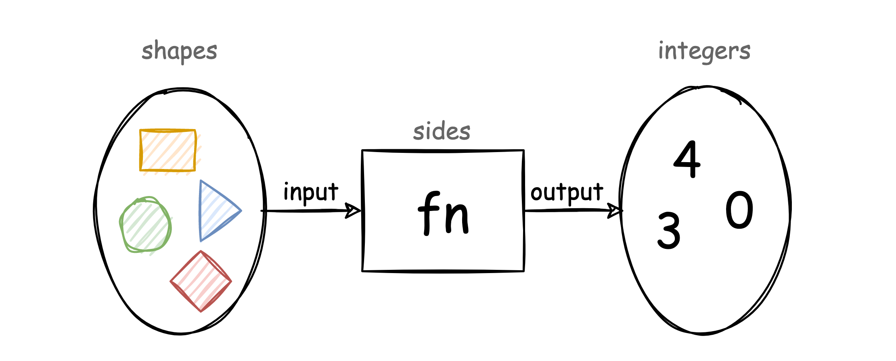
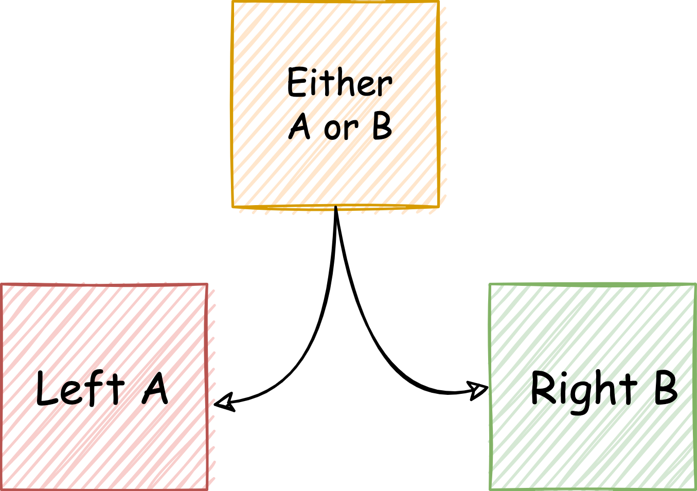
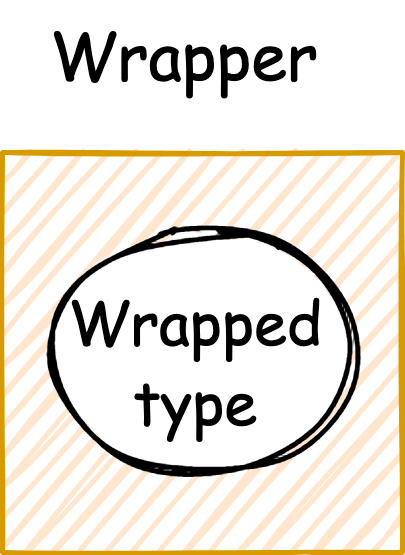
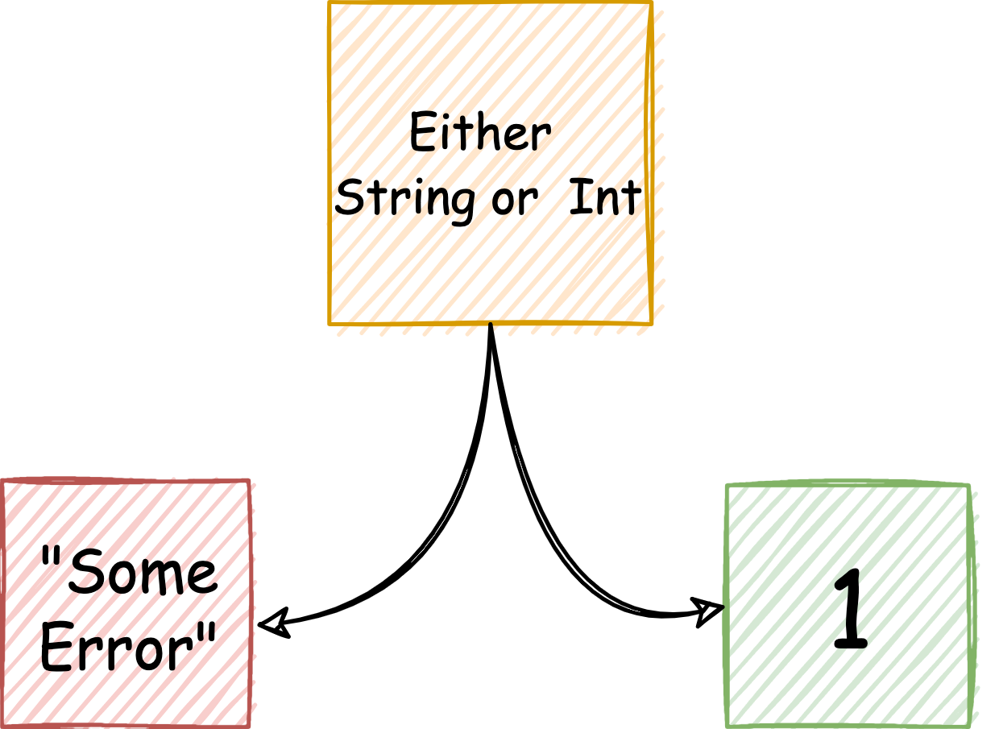

# Monads for humans

Monads, I don't know if your heard about them, if you didn't please keep reading, if you already know about them please 
don't give up and keep reading as well.

The term 'monad' itself is weird but if you google it is even worse, you will be overflowed by a lot of cryptic blogs of 
functional programming trying to explain them or just being arrogant to show how smart-asses they are and how stupid you are.

Well, this is just another one, the difference, I am not a functional expert, just one simple engineer trying to make the 
suffering less painful when it comes to monads. 

Why I am doing this? During my career I've been always trying to keep-up to date but also learn new things, and one of them 
was functional programming, and trust me, when you try to learn it there is a point that you face this scary term, yes, monads.
First reaction? Cool a new thing with a cool name... (after some minutes) ... mmmh, this is abstract ... (after some hours) ... 
this is really hard ... (after weeks) ... I think I am getting it ... (after months) ... Ok, let's start over.

I don't know if you had the same experience but for me it's been challenging in two ways:
1. Understand what a monad is
2. Explain what a Monad is

TBH, I think I will never be successful in any of them, but I least I will try.

Having said that, are you interested?

> You got my attention! I want to learn more!

Note: Maybe some the assumptions are not totally accurate from either mathematical or funtional perspective, but, again, 
I am just trying to explain this useful pattern for non-functional-experts.

## First things first: Some theory

Let's refresh a couple of concepts, because it is always good to keep in mind and reinforce base concepts before go in
details with a more complex topic like Monads.

### What is a function?

In mathematics a function is a relationship between two sets of data, where each element of one corresponds to one element of 
the other. Based in that definition, in programming a function is a relationship between two types, since a data type is a set 
of values. 

<p align="center">
  
</p>

### What is FP?

Is a functional programming paradigm where programs are made composing functions.

Functional Programming is based in [λ-calculus](https://en.wikipedia.org/wiki/Lambda_calculus) (compose and transform)
instead of Imperative Programming, which is based
in [Von Neumann](https://en.wikipedia.org/wiki/Von_Neumann_architecture) models (change state).

Related concepts:

- First class and High Order Functions
- Pure functions and Referential Transparency
- Recursion
- Non-strict Evaluation
- ADTs
- Immutability
- Side effects
- Declarative Programming
- Currying and Partial Application
- **Monads**

FP adds a different way of thinking about problem-solving.

> I had enough, please, explain the topic

One thing more before jump into monads: Let's use a real problem

## The Bank Account

Let's pick up a real and easy problem that will help us to explain the concept along the exercise in a practical way.

We are going to use the simplest bank account implementation that we can use for the sake of explaining the monads
(a real bank account would be far more complex)

```kotlin
data class Account(val balance: BigDecimal)
```

> What is the challenge here?

Operations like `create an account`, `deposit` or `withdraw` are susceptible to fail, let's see how we can deal with
them with monads.

> Why not just raise exceptions?

There is a lot of discussions and strong opinions around this topic over the net, to me is really easy, given an error:

- Is it a crash? Then let it crash, let the exception fly, they are exceptional cases. Errors that you don't
  create/control, that come from other libs, frameworks, external resources, deal with them outside your domain.
- Is it an error that you control? Then use another error handling mechanism.

Why?

- In almost all the languages exceptions hide non-happy case flows, you can not type them in the function signatures,
  therefore, from client perspective you can not even notice and deal with them.
- Using exceptions you are not forced to face your own errors, you can easily let it crash, delegating the control of
  the flow to someone else.
- They can be expensive in terms of performance.

> Yeah, sure, you will need to convince me

## What is a monad?

### A monad is a functional design pattern

**Design pattern**: Reusable solution to a commonly occurring problem within a given context in software design. In OOP
we have the famous GOF - Gang of Four patterns (Singleton, Adapter, Decorator, Strategy, Observer, Visitor...).

A monad is a functional design pattern that solves recurrent problems such as:

- Nullability - Maybe/Option
- **Error Handling - Either**
- DI (Dependency Injection) - Reader
- Logging - Writer
- Side Effects - IO
- State handling - State
- Iterable - List
- Many others ...

#### Either Monad

For our exercise we are going to use one of the most useful ones, the `Either` monad, to handle our errors:

- `Either` type represents values with two possibilities, either `Left` or `Right`

- Convention dictates that `Left` is used for `failure` and `Right` is used for `success`.

- Nnemonic: "right" also means "success/correct/good".

<p align="center">
  
</p>

### A monad is a type in a context

Monads work with a type in a context, where context is a generic container that holds a value:

- Is a type that wraps another type/s.
- Is parameterised
- The context matters, is semantic, gives some form of quality to the underlying type.

<p align="center">
  
</p>

And here a very basic implementation:

```kotlin
sealed class Either<out A, out B> {
    data class Left<A>(val value: A) : Either<A, Nothing>()
    data class Right<B>(val value: B) : Either<Nothing, B>()
}
```

<p align="center">
  
</p>

> Bla bla bla, so boring, show me something real

Sure!

#### Let's create an account

In order to create an account we need to provide a way, we could use the constructor, but it does not allow us to return
other types than the constructed one. Therefore, we can provide a factory method and make the constructor private, with
this we can enforce the invariants of our account.

```kotlin
data class Account private constructor(val balance: BigDecimal) {

    companion object {
        fun create(initialBalance: BigDecimal): Either<NegativeAmount, Account> =
            if (initialBalance < 0) Either.Left(NegativeAmount)
            else Either.Right(Account(initialBalance))
    }
}
```

The code from consumer perspective looks like this:

`Account.create(initialBalance: BigDecimal): Either<NegativeAmount, Account>`

If we try to read it like a text, what is this signature telling us?

`This creates an account with an initial balance, it can either fail because the amount was negative or success`

Amazing 😍, isn't it?

> I still prefer my amazing code throwing exceptions

Are you sure? The same signature with exceptions:

`Acount.create(initialBalance: BigDecimal): Account`

What can go wrong? Nothing, no signals of errors ... a consumer can happily use it without knowing that it can actually
fail, this is a **hidden flow**.

> I don't buy it, I can always:
> 1. Add an amazing documentation.
> 2. Check the implementation.
> 3. Come back to java where I can use checked exceptions.

Well:

1. Documentation: not clean, code should be self-explanatory, and also if you pass the function around as a lambda you
   loose it.
2. Check the implementation: Really? Not clean, a consumer should not know about the implementation details.
3. Sure, come back to java where you can type it with `throws NegativeAmountException`, only one problem, since your
   method is throwing exceptions you can not pass the function around, bye bye High-Order-Functions.

> Ok, fine, you got me bro

### A monad can be mapped over.

What??? Easy, easy, **calm down** mathematicians and functional programming experts!!

Sadly, we can not explain monads without explain another pattern, the Functor.

Basically, a functor is a type that have a mapped over with basically one function:

`fmap: f a -> (a -> b) -> f b` also known as `map`

<diagram-here>

> Functor? fmap? Do I have an arrogant haskeller face?

Ok, ok, maybe you are more familiar with this:

```kotlin
listOf(1, 2).map { it + 1 }
```

You already have used the pattern in many languages and multiple times, mainly in collections when you want to map over
all the elements and change them given a lambda.

Don't think in abstractions, supertypes or interfaces ... the implementation differs depending on the language, you can
understand a functor as:

- A parametric type
- Has a ~`map` function to change the inner value type `A` passing a lambda `(A -> B)`

> Interesting, I was using functors without knowing it ... 🤦‍
> But why this is related to monads?

**A Monad is also a functor** and from client perspective, a monad **without a map function is not the most useful
construct**.

> Why I would need this with our Account?

#### Deposit money into the bank account

What if we want to deposit money to this account?

Easy! we just add a method on the account

```kotlin
data class Account private constructor(val balance: BigDecimal) {

    companion object {
        fun create(initialBalance: BigDecimal): Either<NegativeAmount, Account> =
            if (initialBalance < 0) Either.Left(NegativeAmount)
            else Either.Right(Account(initialBalance))
    }

    fun deposit(amount: BigDecimal): Account = this.copy(balance = this.balance + amount)
}

object NegativeAmount 
```

Now let's try to add money

```kotlin
 val account = Acount.create(100.toBigDecimal())
when (account) {
    is Either.Right -> account.value.deposit(100.toBigDecimal())
    is Either.Left -> TODO() // now what?
}
```

> Come on, this is worse than my beautiful-imperative code! What I have to do now? Throw an exception? And, what is all this boilerplate code?

Wait again, `map` to the rescue!

```kotlin
sealed class Either<out A, out B> {
    class Left<A>(val value: A) : Either<A, Nothing>()
    class Right<B>(val value: B) : Either<Nothing, B>()

    fun <C> map(fn: (B) -> C): Either<A, C> = when (this) {
        is Right -> Right(fn(this.value))
        is Left -> this
    }
}
```

And ...

```kotlin
val account = Acount.create(100.toBigDecimal())
    .map { a -> a.deposit(100.toBigDecimal()) }
```

Boom! Cool, right?

> But then, what if `Acount.create` returns an error?

Our `map` is semantically attached to the type of the monad, in our case to the `Either` monad, it will only apply
the `fn` if we have a `Right`, otherwise the function will be just ignored, our monad is right biased.

> But, what if the amount is negative? What about errors?

Good! Kid, you are sharp, I'll give you that. The next section is going to fix that.

### A Monad is a couple of functions

`**Disclaimer: This is the most important part, pay attention.**`

> I am there!

Monads define two functions:

- One to wrap a value in a monad:

  `return:  a -> m a` also called `unit`
  <diagram-here>

- Another to compose together functions that output monads:

  `bind : m a -> (m -> m b) -> m b` also known as `flatmap`
  <diagram-here>

> What the f****? Please, explain this before I leave

Take it easy, I am going to do it

#### Deposit money into the bank account, second try

Remember our function to deposit money without errors:

```kotlin
data class Account private constructor(val balance: BigDecimal) {
    // other stuff
    fun deposit(amount: BigDecimal): Account = this.copy(balance = this.balance + amount)
}
```

Let's add some errors here:

```kotlin
data class Account private constructor(val balance: BigDecimal) {
    companion object {
        fun create(initialBalance: BigDecimal): Either<NegativeAmount, Account> =
            applyAmount(initialBalance) { Account(it) }

        private fun applyAmount(amount: BigDecimal, fn: (BigDecimal) -> Account) =
            if (amount < ZERO) Either.Left(NegativeAmount)
            else Either.Right(fn(amount))
    }

    fun deposit(amount: BigDecimal): Either<NegativeAmount, Account> =
        applyAmount(amount) { this.copy(balance = this.balance + it) }
}
```

BTW, our `Right` and `Left` constructors could be considered as the `unit` function, they put a value in the Either
context.

Now, it's time to deposit money again:

```kotlin
val account = Acount.create(100.toBigDecimal())
    .map { a -> a.deposit(100.toBigDecimal()) }
```

And the tricky question. Could you tell me the type inferred into the val account?

> Mmmm, I guess is ... Either<NegativeAmount, Account>?

Nope, the type is:

```kotlin
val account: Either<NegativeAmount, Either<NegativeAmount, Account>> = Acount.create(100.toBigDecimal())
    .map { a -> a.deposit(100.toBigDecimal()) }
```

> 🤯, either inception!

Remember `map` a function with type `f a -> (a -> b) -> f b`:

```
f a -> (a -> b) -> f b
Acount.create(100) -> ({a -> a.deposit(100)}) -> account  
Either<NegativeAmount, Account> -> (Account -> Either<NegativeAmount, Account>) -> Either<NegativeAmount, Either<NegativeAmount, Account>>  
```

Guess what,`flatmap` fix this:

```kotlin
sealed class Either<out A, out B> {
    class Left<A>(val value: A) : Either<A, Nothing>()
    class Right<B>(val value: B) : Either<Nothing, B>()

    fun <C> map(fn: (B) -> C): Either<A, C> = when (this) {
        is Right -> Right(fn(this.value))
        is Left -> this
    }
    fun <A, C> flatMap(fn: (B) -> Either<A, C>): Either<A, C> = when (this) {
        is Right -> fn(this.value)
        is Left -> this as Either<A, C>
    }
}
```

And finally:

```kotlin
val account: Either<NegativeAmount, Account> = Acount.create(100.toBigDecimal())
    .flatMap { a -> a.deposit(100.toBigDecimal()) }
```

It is a simple thing, but it took me a while to get it, **`bind~flatmap` is the most important function to understand**,
once you get it, you can use monads without struggling and guessing types.

> Ok, any tip? suggestion?

Yes, think in types, never in what the monad is doing under the hood (implementation), then if you have any value
wrapped in a monad such as `SomeMonad of A`, if you apply a fn:

- If fn goes from `A -> B` apply `map`
- If fn goes from `A -> SomeMonad of B` apply `flatmap`

> Got it!

One more thing, remember that we said that all monads are functors? See this:

```kotlin
sealed class Either<out A, out B> {
    class Left<A>(val value: A) : Either<A, Nothing>()
    class Right<B>(val value: B) : Either<Nothing, B>()

    fun <C> map(fn: (B) -> C): Either<A, C> = flatMap { Right(fn(it)) }

    fun <A, C> flatMap(fn: (B) -> Either<A, C>): Either<A, C> = when (this) {
        is Right -> fn(this.value)
        is Left -> this as Either<A, C>
    }
}
```
`map` can be defined with `unit` and `flatmap`, that's one of the reasons why a monad can be a functor.

### A Monad is a Workflow/Pipeline builder

Monads allow you to compose small operations to create workflows and achieve bigger purposes.

> This statement seems broad and ambiguous to me

Remember what we said about functional programming at the very beginning? **In FP is all about make programs by
composing functions**.

So, this is what monads do, compose functions, chain functions, combine them to create workflows.

> Show it to me

#### Compose deposit and withdraw

Let's introduce a new operation in the account, withdraw money, with this operation we are also introducing a new error:

```kotlin
data class Account private constructor(val balance: BigDecimal) {
    // Other methods

    fun withdraw(amount: BigDecimal): Either<AccountError, Account> =
        applyAmount(amount) { this.copy(balance = this.balance - it) }
            .flatMap {
                if ((balance - amount) < ZERO) Left(NotEnoughFunds) else Right(Account(balance - amount))
            }
}
sealed class AccountError {
    object NegativeAmount : AccountError()
    object NotEnoughFunds : AccountError()
}
```

Scenario 1: Jane wants to open an account with 100, afterwards she will deposit 100 and finally withdraw 150, therefore
an error should pop-up, because Jane has not enough funds.

```kotlin
val account = Account.create(100.toBigDecimal())
    .flatMap { it.deposit(100.toBigDecimal()) }
    .flatMap { it.withdraw(250.toBigDecimal()) }
// account = Left(value=NotEnoughFunds)
```

> Meh!, okayish ... but could you show me how we can use it in my fancy real application? 

Sure, let's create some application Services/Use-Cases.

Scenario 2: We want to create a service to transfer money within two different accounts:

```kotlin
class TransferMoney {
  operator fun invoke(debtor: Account, creditor: Account, amount: BigDecimal): Either<AccountError, Pair<Account, Account>> =
    debtor
      .withdraw(amount)
      .flatMap { d -> creditor.deposit(amount).map { Pair(d, it) } }
}
```

Scenario 3: We want to get an account from a repository, add some cash, and save it back with the new state.

```kotlin
interface AccountRepository {
    fun findBy(userId: UUID): Either<AccountNotFound, Account>
    fun save(account: Account)
}
sealed class AccountError {
    object NegativeAmount : AccountError()
    object NotEnoughFunds : AccountError()
    object AccountNotFound : AccountError()
}

class DepositCash(private val repository: AccountRepository) {
  operator fun invoke(userId: UUID, amount: BigDecimal): Either<AccountError, Unit> =
    repository.findBy(userId)
      .flatMap { it.deposit(amount) }
      .map(repository::save)
}
```

> Ok, finally you have my vote, at least I will consider it in my next project! 

## Summary and Conclusion

I hope this helped someone to understand monads or at least to awake some curiosity on the topic.

I have **skipped** on purpose several topics and important things regarding monads, such as applicatives (sequence, traverse), 
monad laws, fold family, **monad comprehensions** and a lot more, but, as I said at the very beginning, this is just an
introduction, complex topics should be learnt step by step.

A recap, what is a Monad for an imperative mind?

- **A monad is a functional design pattern**, that serves for several purposes such as represent emptiness, error
  handling, side effects ...
- **A monad is a type in a context**, it wraps a type meaningfully.
- **"A monad can be mapped over"**, implements in one way or another the `map` function
- **A Monad is a couple of functions**, `unit` and `flatmap`
- **A Monad is a Workflow/Computation builder**, you can compose, chain and combine to create a business flow.
